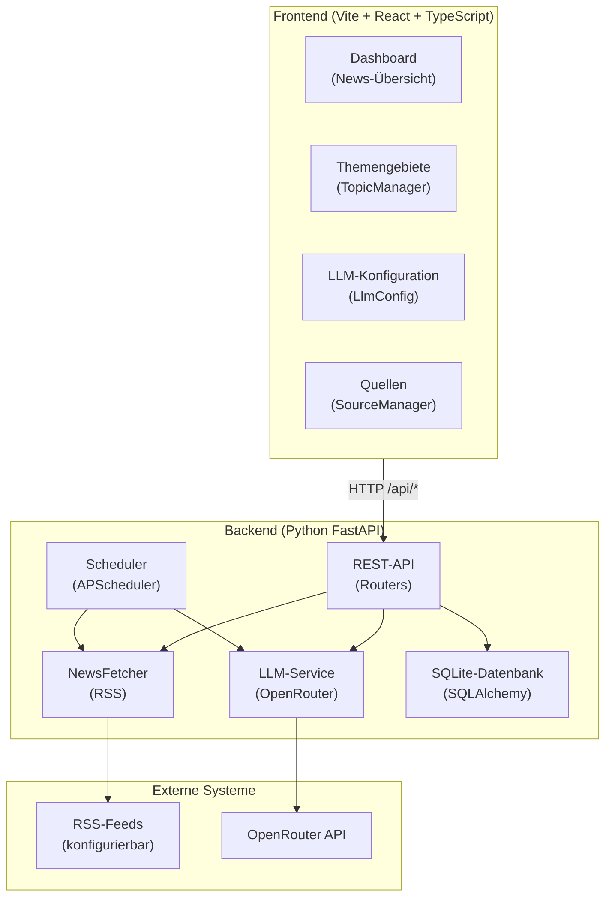

# NewsCompacter – Dokumentation

## Überblick

NewsCompacter ist eine lokale Web-Anwendung, die Nachrichten aus konfigurierbaren RSS-Quellen sammelt,
mittels LLM mit Tags und Zusammenfassungen versieht, Dubletten zusammenführt und thematisch gruppiert darstellt.
Die Anwendung besteht aus einem Python/FastAPI-Backend und einem React/TypeScript-Frontend.

## Grobarchitektur



## Schnittstellen

| Methode | Pfad | Beschreibung |
|---|---|---|
| GET | `/api/topics` | Alle Themengebiete |
| POST | `/api/topics` | Thema anlegen |
| PUT | `/api/topics/{id}` | Thema aktualisieren |
| DELETE | `/api/topics/{id}` | Thema löschen |
| GET | `/api/news` | Nachrichten (optional `?topic_id=`, `?keyword=` zum clientseitigen Filtern) |
| PATCH | `/api/news/{id}` | Nachricht aktualisieren (z.B. `is_saved`) |
| GET | `/api/llm-config` | LLM-Konfiguration abrufen |
| PUT | `/api/llm-config` | LLM-Konfiguration speichern |
| POST | `/api/fetch/now` | Manuellen Fetch auslösen |
| POST | `/api/fetch/enrich` | Nachträgliche LLM-Anreicherung (Tags + Summary) |
| GET | `/api/fetch/interval` | Aktuelles Fetch-Intervall |
| POST | `/api/fetch/interval` | Fetch-Intervall setzen |
| GET | `/api/tag-prefs` | Alle Tag-Bewertungen |
| PUT | `/api/tag-prefs` | Tag als relevant/irrelevant markieren |
| DELETE | `/api/tag-prefs/{name}` | Tag-Bewertung löschen |
| GET | `/api/sources` | Alle Quellen |
| POST | `/api/sources` | Quelle anlegen |
| PUT | `/api/sources/{id}` | Quelle aktualisieren |
| DELETE | `/api/sources/{id}` | Quelle löschen |
| GET | `/api/sources/suggest` | LLM-basierte Quellen-Vorschläge |
| GET | `/api/settings/language` | Aktuelle Sprache abrufen |
| PUT | `/api/settings/language` | Sprache setzen (DEU/ENG/ORIG) |

## Datenbank (SQLite)

| Tabelle | Beschreibung |
|---|---|
| `topics` | Themengebiete (Name, is_important) – Defaults werden beim ersten Start angelegt |
| `news` | Nachrichten (Titel, Quelle[n], URLs, Content, Summary, image_url, Fingerprint) |
| `news_tags` | Vom LLM generierte Tags (news_id, tag_name) |
| `tag_preferences` | Benutzer-Feedback zu Tags (relevant/irrelevant) |
| `news_sources` | Konfigurierte RSS/News-Quellen (Name, URL, Typ, enabled) |
| `llm_config` | LLM-Provider-Konfiguration |
| `settings` | Fetch-Intervall, Sprache (DEU/ENG/ORIG) |

## LLM-Integration

- Standard-Provider: **OpenRouter** (kostenloses Model: `meta-llama/llama-3.2-3b-instruct`)
- Nutzung für:
  - **Tag-Generierung** – 3–5 Schlagwörter pro Nachricht
  - **Zusammenfassung** – 1–2 Sätze Summary pro Nachricht
  - **Deduplizierung** – Erkennung semantischer Duplikate + Merge von Quellen/URLs
  - **Quellen-Vorschläge** – intelligente RSS-Empfehlungen
  - **Sprachsteuerung** – Antworten in DEU/ENG/ORIG je nach Einstellung

## Dubletten-Behandlung

- **Fingerprint** basiert nur auf dem Titel (source-agnostisch)
- Gleicher Titel aus verschiedenen Quellen → ein Eintrag
  - Quellen-Namen werden mit ` + ` kombiniert
  - URLs werden mit ` | ` kombiniert
  - Längster Content gewinnt, erstes Bild bleibt erhalten
- LLM-basierte Deduplizierung: `deduplicate_articles()` gruppiert semantisch ähnliche Artikel (auch bei unterschiedlichen Titeln) und führt Quellen/URLs/Content zusammen. Wird automatisch während der LLM-Anreicherung ausgeführt.

## Score-basierte Sortierung

- Score = (Anzahl `important`-Tags) − (Anzahl `unimportant`-Tags)
- Nachrichten werden innerhalb jeder Gruppe absteigend nach Score sortiert
- Kein Ausblenden von Nachrichten (alle bleiben sichtbar)

## Artikel-Content-Extraktion

- RSS-Feeds liefern oft nur Kurztexte oder Überschriften
- Wenn RSS-Content < 80 Zeichen → Artikel-URL wird abgerufen
- Extraktion: `<script>`/`<style>`/`<nav>` entfernt, dann `<article>`- oder `<body>`-Text extrahiert
- Limit: max 2000 Zeichen, Zeilen unter 30 Zeichen herausgefiltert
- Benötigt keine zusätzlichen Bibliotheken (nutzt httpx + regex)

## Betrieb

### Backend starten

```bash
cd backend
pip install -r requirements.txt --break-system-packages
uvicorn main:app --host 0.0.0.0 --port 8000
```

### Frontend starten

```bash
cd frontend
npm install
npm run dev
```

### Komplettstart (start.sh)

```bash
./start.sh
```

Dann im Browser `http://localhost:8000` öffnen (Backend serviert das gebaute Frontend).  
Im Entwicklungsmodus zusätzlich `npm run dev` im `frontend/`-Verzeichnis starten und `http://localhost:5173` öffnen.

## Verwendete Technologien

- **Backend**: [FastAPI](https://fastapi.tiangolo.com) (Python), [SQLAlchemy](https://www.sqlalchemy.org), [APScheduler](https://apscheduler.readthedocs.io), [httpx](https://www.python-httpx.org), [feedparser](https://feedparser.readthedocs.io)
- **Frontend**: [React](https://react.dev) 18, [TypeScript](https://www.typescriptlang.org), [Vite](https://vite.dev), [React Router](https://reactrouter.com)
- **Datenbank**: [SQLite](https://www.sqlite.org) (via [aiosqlite](https://github.com/omnilib/aiosqlite))
- **LLM**: [OpenRouter](https://openrouter.ai) (kompatibel mit OpenAI-API-Format)
- **News-Quellen**: RSS-Feeds (konfigurierbar)

## Einstellungen

1. **LLM-Config**: OpenRouter API-Key eintragen (Pflichtfeld für Tags/Summaries)
2. **Themengebiete**: 3 Default-Topics werden beim ersten Start angelegt (Weltpolitik, Deutschlandpolitik, etc.)
3. **Quellen**: RSS-Feeds verwalten (hinzufügen, aktivieren, deaktivieren, löschen)
4. **Sprache**: DEU / ENG / ORIG über Umschalter in der Navigation
5. **Zyklischer Abruf**: Intervall wählen (stündlich / 6h / 24h / aus)
6. **Dashboard**: Nachrichten thematisch gruppiert; Tags bewerten (+/−)
7. **Keyword-Filter**: Im Dashboard Suchbegriffe (Komma-getrennt) eingeben → Nachrichten werden gefiltert und Treffer in Titel/Summary/Content gelb hervorgehoben

## Datenaufbewahrung

- **Ungespeicherte** Nachrichten älter als 8 Tage werden automatisch gelöscht (`RETENTION_DAYS = 8`)
- **Gespeicherte** Nachrichten (`★`-Markierung) bleiben dauerhaft erhalten
- Beim Löschen eines Themengebiets werden verknüpfte Nachrichten nicht gelöscht – ihre `topic_id` wird auf `NULL` gesetzt

## Wichtige Trennung

- **Themengebiete (Topics)**: Werden **nur** im TopicManager vom Benutzer angelegt und bestimmen die Kapitel im Dashboard
- **Tags**: Werden vom LLM generiert und sind Schlagwörter pro Nachricht. `+`/`−` speichert eine Präferenz in `tag_preferences`, erzeugt aber **kein** neues Themengebiet
